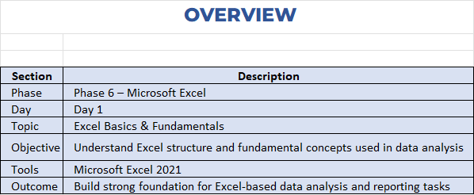
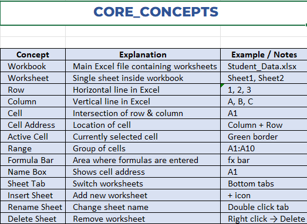
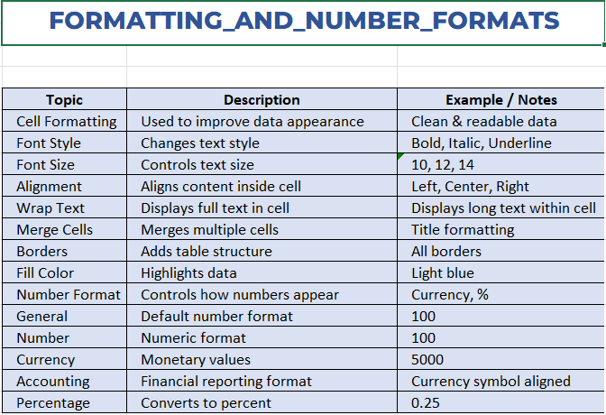
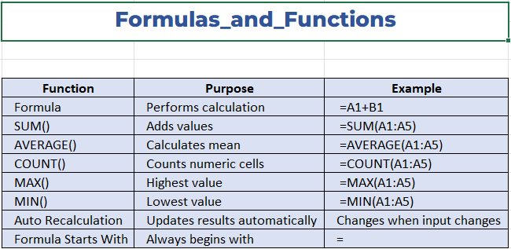
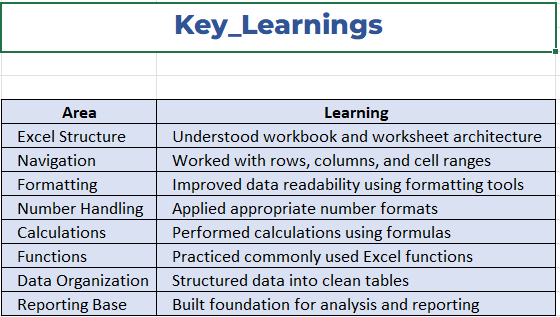

# 📘 Excel – Phase 6 | Day 76  
## 📌 Topic: Excel Basics & Fundamentals

This day focuses on building a strong foundation in **Microsoft Excel**, covering core concepts required for data handling, reporting, and analysis in real-world business scenarios.

---

## 🧠 Learning Overview

| Section | Description |
|------|-------------|
| Phase | Phase 6 – Microsoft Excel |
| Day | Day 76 |
| Topic | Excel Basics & Fundamentals |
| Tool | Microsoft Excel 2021 |
| Objective | Understand Excel structure and fundamental concepts used in data analysis |
| Outcome | Build strong foundation for Excel-based data analysis and reporting tasks |

---

## 📂 Folder Structure


```
Day_76_Excel_Basics/
│
├── 01_Notes.xlsx
├── 02_Tasks.xlsx
├── 03_Solutions.xlsx
├── README.md
│
└── screenshots/
├── overview.png
├── core_concepts.png
├── formatting.png
├── formulas.png
└── key_learnings.png
```


---

## 🔹 Excel Overview

- Understanding workbook and worksheet structure  
- Purpose of Excel in data management  
- Basic Excel environment awareness  



---

## 🔹 Core Concepts

- Workbook and Worksheet  
- Rows and Columns  
- Cell and Cell Address  
- Active Cell  
- Range of cells  
- Formula Bar and Name Box  
- Sheet operations (insert, rename, delete)  



---

## 🔹 Formatting & Number Formats

- Cell formatting for readability  
- Font style and font size  
- Alignment and wrap text  
- Borders and fill colors  
- Number formats:
  - General
  - Number
  - Currency
  - Accounting
  - Percentage  



---

## 🔹 Formulas & Functions

- Formula syntax (`=`)  
- Auto recalculation behavior  
- Basic Excel functions:
  - `SUM()`
  - `AVERAGE()`
  - `COUNT()`
  - `MAX()`
  - `MIN()`  



---

## 🔹 Key Learnings

- Understood Excel workbook architecture  
- Learned data organization techniques  
- Improved data presentation using formatting  
- Performed basic calculations using formulas  
- Built foundation for advanced Excel topics  



---

## 📝 Practice Work

### 📘 Tasks File
- Created employee dataset  
- Added joining year and salary columns  
- Applied formatting and layout improvements  
- Created summary worksheet  

### 📗 Solutions File
- Calculated total employees  
- Computed total, average, highest, and lowest salary  
- Applied currency number formatting  
- Designed clean salary summary report  

---

## 🎯 Real-World Applications

- Employee data management  
- Salary analysis reports  
- Structured business data handling  
- Preparation for dashboards and analytics  

---

## ✅ Outcome

Day 76 helped build a solid Excel foundation and prepared me for:
- Logical functions  
- Data validation  
- Lookup functions  
- Real-world Excel analytics workflows  

---

🚀 **Phase 6 – Excel learning successfully started**
